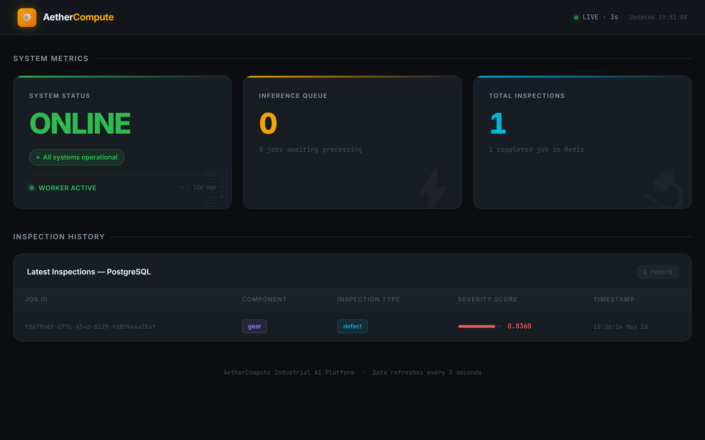
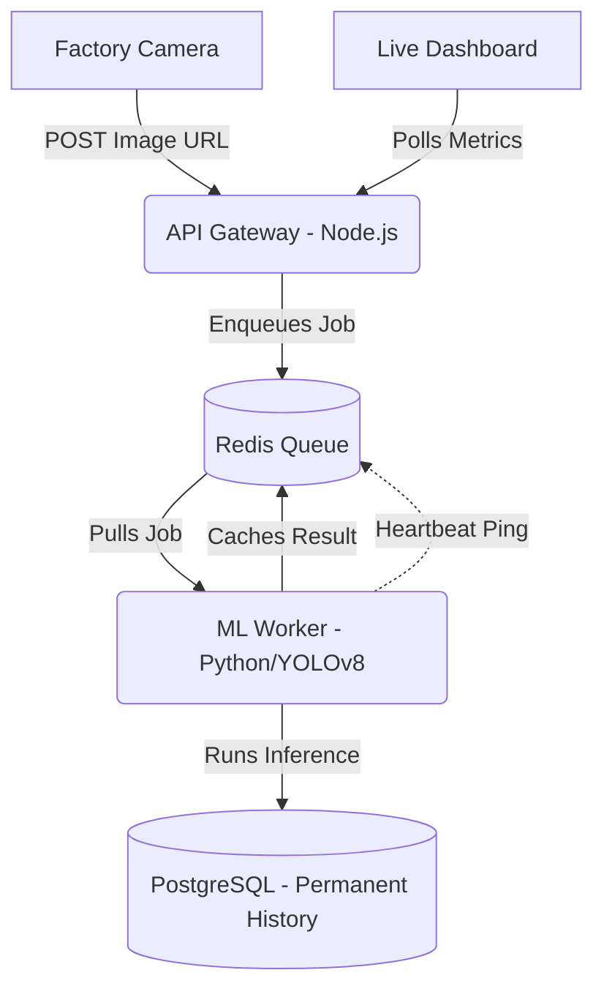

# AetherCompute: Industrial AI Inspection Platform

      
<p align="center">
  
</p>

### Overview
AetherCompute is a distributed, production-grade AI inspection platform that processes high-throughput manufacturing imagery in real-time to automatically detect component defects.

### Motivation
In industrial settings, manufacturing lines move quickly, and defect detection needs to be immediate and reliable. I built AetherCompute to solve the problem of fragile, resource-heavy AI pipelines. Many prototype ML systems crash due to memory leaks, disk bloat, or database disconnects during continuous uptimes. This project demonstrates how to move an AI model out of a prototype environment and into a hardened, "fail-safe" architecture that can survive in a 24/7 manufacturing facility.

### Architecture
The system is decoupled into three primary components, using an asynchronous, queue-based architecture:



1. **API Gateway (Node.js/Express):** A hardened entry point that handles input validation, payload limits (5MB), and queue depth guarding (returns HTTP 503 when the system is at capacity to prevent upstream OOM failures).
2. **ML Worker (Python/YOLOv8):** An asynchronous machine learning worker. It pulls jobs from Redis, dynamically loads parametric AI models via an LRU (Least-Recently-Used) cache, runs memory-safe inference, and persists the results.
3. **Monitoring Dashboard (Vanilla JS/HTML/CSS):** A zero-dependency, real-time industrial dashboard. It visualizes the inference queue, inspection history, and worker health utilizing CSS animations and live API polling.

#### 🛡️ Production Hardening
- **LRU Model Cache:** Bounded in-memory model caching prevents RAM exhaustion when switching between numerous component-specific models.
- **Explicit Garbage Collection:** Manual memory management to prevent fragmentation after processing large PIL image buffers.
- **Resilient Network Session:** Configured `urllib3.util.Retry` with exponential backoff (status 429, 500, 502, 503, 504) to handle transient network instability during image and model downloads.
- **Unified Error Persistence:** An explicit `error_message` column in PostgreSQL ensures job failures are tracked without corrupting the expected JSON schema for `detected_objects`.
- **Scalable SQL Metrics:** Replaced O(N) Redis `KEYS` queries with high-performance PostgreSQL aggregation queries for `/metrics`.
- **Data Retention Cleanup:** Automated hourly garbage collection purging inspection data older than 30 days to prevent database bloat.
- **Resource Constraints:** Strict Docker Compose limits (`deploy.resources.limits`) on memory and CPU to prevent host resource exhaustion.
- **PostgreSQL Connection Guards:** Transparent reconnection logic (`ensure_connection()`) to survive database drops without terminating the worker.
- **Self-Reporting Worker Pulse:** The worker writes a TTL-based heartbeat (60s) to Redis containing its PID and latency. The API consumes this heartbeat, allowing the dashboard to natively monitor ML liveness without requiring SSH access.

### Getting Started

**Prerequisites:** Docker & Docker Compose, Node.js v18+, Python 3.10+ (if running standalone)

1. **Environment Setup:** Create a `.env` file in the root directory (refer to `.env.example`):
   ```env
   PORT=3000
   REDIS_HOST=message-broker
   REDIS_PORT=6379
   DB_HOST=database
   DB_PORT=5432
   DB_USER=aether
   DB_PASSWORD=secret
   DB_NAME=aether_db
   MAX_QUEUE_DEPTH=100
   MODEL_CACHE_MAX_SIZE=5
   HEARTBEAT_INTERVAL=30
   ```
   *(Note: If running standalone outside Docker, set `REDIS_HOST=localhost` and `DB_HOST=localhost`)*

2. **Option A: Full Docker Compose Deployment (Recommended)**
   Launch the entire stack (API Gateway, ML Worker, Redis, PostgreSQL) in containerized environments with configured resource limits:
   ```bash
   docker-compose up -d
   ```
   Access the real-time monitoring dashboard at `http://localhost:3000`.

3. **Option B: Standalone / Local Development**
   Start only the infrastructure containers:
   ```bash
   docker-compose up -d message-broker database
   ```
   
   Start the ML Worker:
   ```bash
   cd worker
   pip install -r requirements.txt
   python worker.py
   ```
   
   Start the API Gateway & Dashboard:
   ```bash
   cd api
   npm install
   npm start
   ```
   Access the dashboard at `http://localhost:3000`.

### Roadmap
- **Authentication & Security:** Implement JWT-based authentication on the API Gateway to secure the `POST /task` endpoint from unauthorized submissions.
- **Job Retry Mechanism:** Add a Dead Letter Queue (DLQ) and a "Retry" button on the dashboard for jobs that fail due to transient network issues (e.g., 404 image links).
- **Horizontal Scaling:** Transition the ML Worker to Kubernetes (KEDA) for event-driven horizontal scaling based on Redis queue depth.
- **Automated Testing:** Implement a robust suite of unit tests for the worker and API, as well as end-to-end integration tests mimicking factory floor cameras.

### About
> This is a personal portfolio project built to demonstrate production-grade AI system design.
